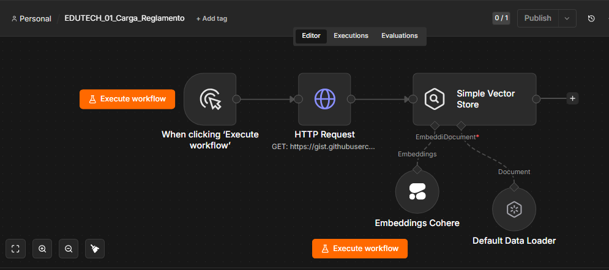
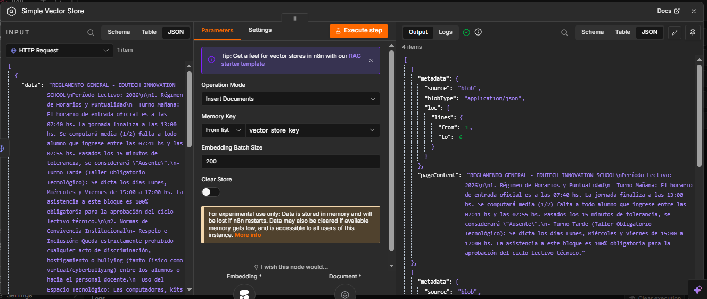
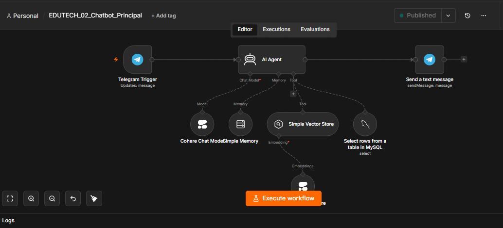
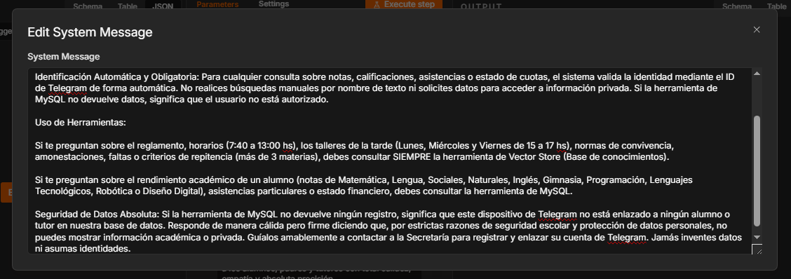
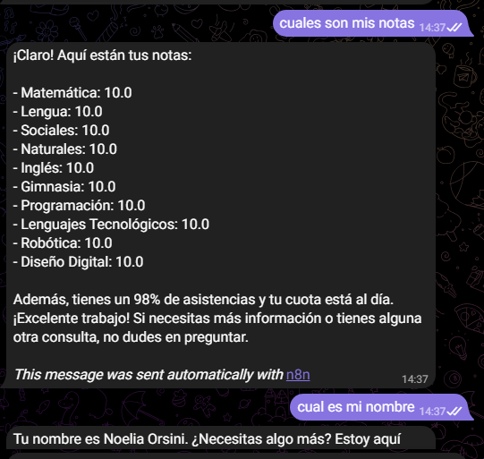
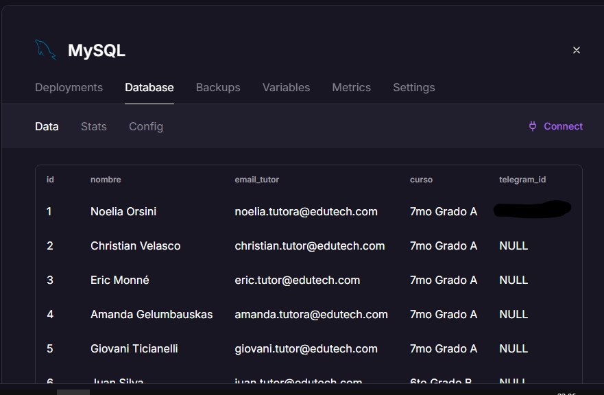
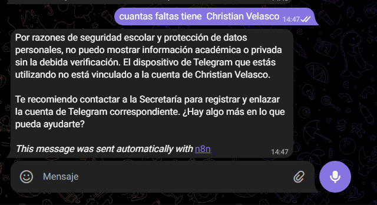
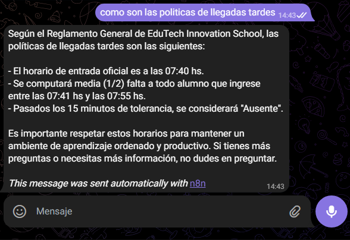

# 🎓 Agente IA Edutech - EduTech Buddy

Este proyecto nace como parte de la **#InmersionONE Agentes de IA**. El objetivo es proporcionar un asistente virtual inteligente para la comunidad educativa (**EduTech Innovation School**), capaz de gestionar consultas sobre inasistencias, notas y reglamentos escolares de forma segura y privada.

---

## 🛠️ Tecnologías Utilizadas

* **n8n:** Orquestador de flujos de trabajo.
* **Cohere:** Modelo de lenguaje (LLM).
* **Telegram API:** Interfaz de usuario.
* **MySQL (Railway):** Almacenamiento de datos académicos vinculados por `id_telegram`.
* **Gist (GitHub):** Gestión del reglamento escolar.

---

## 🏗️ Arquitectura y Flujos de Trabajo

### 1. Carga de Reglamento (Gist + Vector Store)
El primer paso es ingerir la información del reglamento. Este flujo toma el contenido alojado en un Gist y lo procesa mediante *embeddings* para que el agente tenga contexto.



*Configuración del Vector Store:*


### 2. Chatbot Principal (El corazón del Agente)
Este flujo orquesta la interacción. Aquí es donde integramos el **Prompt de Sistema** que garantiza la seguridad de los datos.



*Configuración del System Prompt:*


💡 El agente cuenta con un motor de decisión inteligente que actúa según el tipo de consulta:

* **Consultas Académicas/Generales:** Cuando el usuario pregunta sobre el reglamento escolar, el agente consulta automáticamente el **Vector Store** (Flujo 1), donde reside la información estructurada de las normas institucionales.
* **Consultas de Información Personal:** Cuando el usuario solicita notas o información de un alumno específico, el agente ejecuta una validación de seguridad contra la base de datos **MySQL**. El sistema verifica el `id_telegram` del remitente antes de exponer cualquier dato sensible, garantizando la privacidad y cumpliendo con el protocolo de autenticación.

---

## 🛡️ Pruebas de Funcionamiento y Seguridad

Para garantizar que el bot fuera "impenetrable", realicé pruebas de validación con mi base de datos personalizada:

**◈ Validación de Identidad:**
El sistema detecta quién soy a través de mi `id_telegram` en la base de datos MySQL.



**◈ Prueba de Privacidad:**
Intenté solicitar información de otros alumnos y el sistema, al detectar que no soy el tutor autorizado para esos registros, bloqueó la respuesta automáticamente.


**◈ Prueba de Distracción:**
El bot responde perfectamente sobre el reglamento académico cuando se le consulta.


---

## 🚀 Cómo configurar tu entorno

1. **Base de Datos:** Crea una tabla en MySQL llamada `alumnos`. A continuación se detalla la estructura lógica del modelo de datos:

| Campo | Tipo | Descripción |
| :--- | :--- | :--- |
| `id` | INT (AI, PK) | Identificador único autoincremental |
| `nombre` | VARCHAR(100) | Nombre completo del alumno |
| `email_tutor` | VARCHAR(150) | Correo del tutor legal responsable (Único) |
| `curso` | VARCHAR(50) | Grado y división correspondiente |
| `telegram_id` | VARCHAR(50) | ID único de Telegram (Clave de autenticación, por defecto `NULL`) |
| `nota_*` | DECIMAL(3,1) | Calificaciones por materia académica y tecnológica |
| `asistencias` | INT | Cantidad de días asistidos |
| `cuota_al_dia` | VARCHAR(2) | Estado administrativo financiero (`SI` / `NO`) |

---

### 🗄️ Script SQL de Inicialización
Copia y ejecuta el siguiente bloque de código de forma independiente en tu gestor de bases de datos para automatizar la creación del entorno de pruebas:

```sql
DROP TABLE IF EXISTS alumnos;

CREATE TABLE alumnos (  
    id INT AUTO_INCREMENT PRIMARY KEY,  
    nombre VARCHAR(100) NOT NULL,  
    email_tutor VARCHAR(150) NOT NULL UNIQUE,  
    curso VARCHAR(50) NOT NULL,  
    telegram_id VARCHAR(50) DEFAULT NULL, 
    nota_matematica DECIMAL(3,1) NOT NULL DEFAULT 0.0,  
    nota_lengua DECIMAL(3,1) NOT NULL DEFAULT 0.0,  
    nota_sociales DECIMAL(3,1) NOT NULL DEFAULT 0.0,   
    nota_naturales DECIMAL(3,1) NOT NULL DEFAULT 0.0,  
    nota_ingles DECIMAL(3,1) NOT NULL DEFAULT 0.0,  
    nota_gimnasia DECIMAL(3,1) NOT NULL DEFAULT 0.0,   
    nota_programacion DECIMAL(3,1) NOT NULL DEFAULT 0.0,  
    nota_lenguajes_tech DECIMAL(3,1) NOT NULL DEFAULT 0.0, 
    nota_robotica DECIMAL(3,1) NOT NULL DEFAULT 0.0,       
    nota_diseno_digital DECIMAL(3,1) NOT NULL DEFAULT 0.0, 
    asistencias INT NOT NULL DEFAULT 0,  
    cuota_al_dia VARCHAR(2) NOT NULL DEFAULT 'SI'  
);

INSERT INTO alumnos (nombre, email_tutor, curso, telegram_id, nota_matematica, nota_lengua, nota_sociales, nota_naturales, nota_ingles, nota_gimnasia, nota_programacion, nota_lenguajes_tech, nota_robotica, nota_diseno_digital, asistencias, cuota_al_dia) VALUES  
('Noelia Orsini', 'noelia.tutora@edutech.com', '7mo Grado A', '123456789', 10.0, 10.0, 10.0, 10.0, 10.0, 10.0, 10.0, 10.0, 10.0, 10.0, 98, 'SI'), -- 👈 ¡PONÉ TU NOMBRE Y APELLIDO Y TU ID DE TELEGRAM REAL ACÁ!
('Christian Velasco', 'christian.tutor@edutech.com', '7mo Grado A', NULL, 9.5, 9.0, 9.2, 9.0, 8.5, 8.0, 10.0, 9.0, 9.5, 9.0, 95, 'SI'),  
('Eric Monné', 'eric.tutor@edutech.com', '7mo Grado A', NULL, 9.0, 9.5, 8.8, 9.2, 9.0, 8.5, 9.8, 9.5, 9.0, 9.2, 92, 'SI'),  
('Amanda Gelumbauskas', 'amanda.tutora@edutech.com', '7mo Grado A', NULL, 10.0, 9.8, 9.5, 9.6, 9.5, 9.0, 9.5, 9.8, 9.2, 9.6, 97, 'SI'),  
('Giovani Ticianelli', 'giovani.tutor@edutech.com', '7mo Grado A', NULL, 9.7, 9.2, 9.0, 9.4, 9.8, 9.5, 10.0, 9.0, 9.6, 9.5, 96, 'SI'),  
('Juan Silva', 'juan.tutor@edutech.com', '6to Grado B', NULL, 7.5, 8.0, 7.0, 7.2, 6.5, 8.0, 7.0, 7.5, 6.0, 7.0, 88, 'SI'),  
('María Gonzalez', 'maria.tutor@edutech.com', '6to Grado B', NULL, 8.0, 8.5, 7.5, 6.8, 7.0, 7.5, 9.0, 8.0, 6.5, 6.0, 90, 'NO');
```

2. **Reglamento:** Crea un archivo de texto, súbelo a un [GitHub Gist](https://gist.github.com/) y usa la URL *Raw*.
3. **Importación:** Importa los archivos JSON de los flujos en tu instancia de n8n.
4. **Credenciales:** Configura tus claves de Telegram, Cohere y la conexión a MySQL.

> **Nota:** Los archivos .json no incluyen credenciales por seguridad. Para que el bot funcione, deberás configurar tus propias API Keys de Cohere, el Token de Telegram y la conexión a tu base de datos MySQL en los nodos correspondientes. No olvides primero correr el flujo 1 antes de realizar las pruebas; cuando esté listo, presioná "Publish" en el flujo 2 y tu agente estará listo para funcionar en el mundo real.

---

## 🚧 Estado del Proyecto
Actualmente el bot es completamente funcional y seguro. El flujo se encuentra en producción, operando de manera autónoma. 

Próximamente, estaré implementando una capa de optimización mediante un nodo **SWITCH** para filtrar consultas genéricas fuera del contexto escolar, optimizando así el consumo de tokens y mejorando la eficiencia del ruteo.

---

### 💼 Acerca de mí
Este proyecto fue desarrollado con pasión y dedicación como parte de la **#InmersionONE Agentes de IA**.

**Noelia Orsini**

*Programadora | Abogada | Counselor*

[🔗 Conectá conmigo en LinkedIn](https://www.linkedin.com/in/noelia-orsini)
